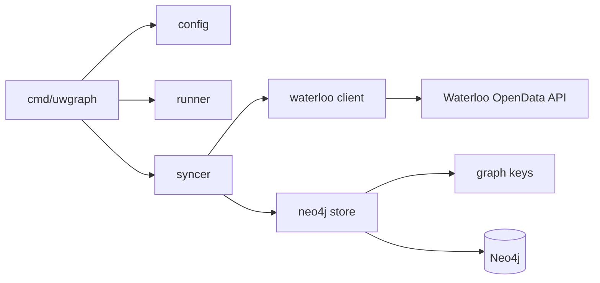

# Architecture

UW Graph Sync is a single Go worker. It periodically reads University of
Waterloo OpenData endpoints and idempotently upserts their data into Neo4j.

## Package Responsibilities

| Package | Responsibility |
| --- | --- |
| `cmd/uwgraph` | Load configuration, initialize dependencies, handle signals, and start the runner. |
| `internal/config` | Parse required and optional environment variables with validated defaults. |
| `internal/waterloo` | Issue authenticated HTTP requests, retry transient failures, and decode API responses. |
| `internal/syncer` | Order datasets and terms, apply failure policy, and report progress. |
| `internal/graph` | Construct stable keys used as Neo4j identities. |
| `internal/neo4jstore` | Ensure constraints/indexes and execute batched parameterized writes. |
| `internal/runner` | Run immediately, schedule later syncs, prevent overlap, and enforce sync timeouts. |

Interfaces for Waterloo reads and graph writes live in `internal/syncer`, where
they are consumed. Dependency wiring remains manual in `cmd/uwgraph`.

## Runtime Lifecycle

1. Load `.env` when present, then parse configuration; existing environment
   variables win.
2. Create the Neo4j driver and retry connectivity until
   `UWGRAPH_STARTUP_TIMEOUT`.
3. Start one sync immediately, then trigger at `UWGRAPH_SYNC_INTERVAL`.
4. Give each sync a `UWGRAPH_SYNC_TIMEOUT`; skip a tick if work is still active.
5. On `SIGINT` or `SIGTERM`, cancel work, wait for the active sync, and close
   the driver.

The process is stateless. Neo4j is the only persistent backing service, and
logs are structured JSON written to stdout.

## Failure Semantics

Waterloo HTTP failures are isolated by dataset, term, or course ID. The sync
logs a warning and continues work that does not depend on that response.
Neo4j schema and write errors stop the current sync because continuing could
leave graph relationships incomplete. The next scheduled sync retries all
idempotent upserts.

`uw-openapi/swagger.json` is an upstream reference snapshot for endpoint and
field research. It is not generated during builds and should only change as
part of an intentional API-reference refresh.
