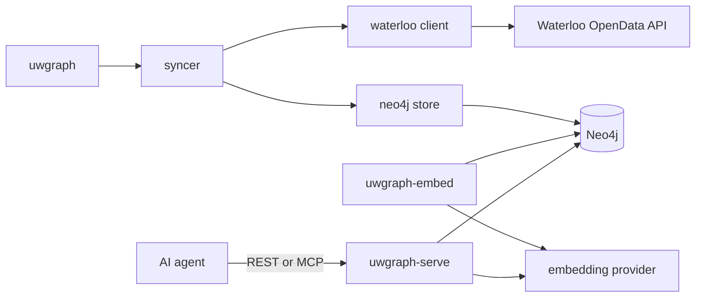

# Architecture

UW Graph is three Go processes backed by one Neo4j database. The sync worker
ingests authoritative data, the embedding worker maintains semantic indexes,
and the knowledge server exposes cited retrieval to agents.

## Package Responsibilities

| Package | Responsibility |
| --- | --- |
| `cmd/uwgraph*` | Thin process wiring for sync, embedding, and serving. |
| `internal/config` | Parse required and optional environment variables with validated defaults. |
| `internal/waterloo` | Issue authenticated HTTP requests, retry transient failures, and decode API responses. |
| `internal/syncer` | Order datasets and terms, apply failure policy, and report progress. |
| `internal/graph` | Construct stable keys used as Neo4j identities. |
| `internal/neo4jstore` | Schema, parameterized writes, graph reads, full-text search, and vector search. |
| `internal/knowledge` | Retrieval contracts and deterministic document projections. |
| `internal/embedding` | OpenAI-compatible client and stale-document worker. |
| `internal/retrieval` | Validation and reciprocal-rank hybrid fusion. |
| `internal/knowledgeapi` | Bearer-authenticated REST and MCP transport. |
| `internal/runner` | Run immediately, schedule later syncs, prevent overlap, and enforce sync timeouts. |

Interfaces for Waterloo reads and graph writes live in `internal/syncer`, where
they are consumed. Dependency wiring remains manual in `cmd/uwgraph`.

## Runtime Lifecycle

The sync worker runs immediately and then on `UWGRAPH_SYNC_INTERVAL`. The
embedding worker creates the vector index, embeds documents whose content hash
or model changed, then polls. The server refuses startup until both knowledge
indexes and the embedding provider are ready. All processes handle termination
signals and close Neo4j cleanly.

Neo4j is the only persistent service. An external vector database is not
needed. An external or locally hosted OpenAI-compatible embeddings endpoint is
required; the LLM/agent runtime is intentionally outside this service.

## Failure Semantics

Waterloo HTTP failures are isolated by dataset, term, or course ID. The sync
logs a warning and continues work that does not depend on that response.
Neo4j schema and write errors stop the current sync because continuing could
leave graph relationships incomplete. The next scheduled sync retries all
idempotent upserts.

Hybrid retrieval is strict: embedding, full-text, or vector failure makes the
request unavailable rather than silently changing retrieval quality. An
updated document is excluded from vector search until its matching content
hash is embedded.

`uw-openapi/swagger.json` is an upstream reference snapshot for endpoint and
field research. It is not generated during builds and should only change as
part of an intentional API-reference refresh.
