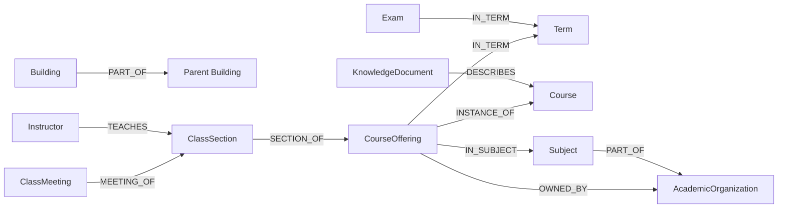

# Graph Model

Neo4j writes are idempotent: nodes are merged by stable identity properties,
then properties and relationships are updated. Constraints are created by
`Store.EnsureSchema`.

## Nodes

| Label | Identity property | Source |
| --- | --- | --- |
| `Term` | `termCode` | Terms |
| `Course` | `courseCode` | Courses across terms |
| `CourseOffering` | `offeringKey` | Course in a specific term/offer |
| `Subject` | `code` | Subjects |
| `AcademicOrganization` | `code` | Academic organizations |
| `Building` | `buildingCode` | Locations |
| `ClassSection` | `sectionKey` | Scheduled classes |
| `ClassMeeting` | `meetingKey` | Class schedule entries |
| `Instructor` | `instructorKey` | Hashed upstream instructor identifier |
| `Exam` | `examKey` | Exam schedules |
| `KnowledgeDocument` | `documentKey` | Deterministic searchable projection |

`KnowledgeDocument` has a full-text index over title, text, and aliases, plus a
cosine vector index over `embedding`. The embedding dimension is configured at
index creation.

## Relationships

The current API does not provide a reliable normalized building identifier for
every class meeting or exam location, so those records keep location text
rather than creating a building relationship.

## Identity Keys

Key construction is centralized in `internal/graph`:

- `courseCode`: trimmed subject and catalog number, separated by one space.
- `offeringKey`: `termCode|courseID|courseOfferNumber`.
- `sectionKey`:
  `termCode|courseID|courseOfferNumber|sessionCode|classSection|classNumber`.
- `meetingKey`: `sectionKey|classMeetingNumber`.
- `instructorKey`: SHA-256 digest of the trimmed upstream identifier.
- `examKey`: `exam:` plus the SHA-1 digest of trimmed term, display name,
  sections, start date, and start time joined with `|`.
- `documentKey`: kind prefix plus the canonical source entity key, for example
  `course:CS 135`.

SHA-1 is used here only as a deterministic identifier, not for security.
Changing any formula can create duplicate nodes and orphan existing
relationships.

Knowledge documents store `contentHash`, source endpoint, source entity key,
entity URI, and sync time. Embeddings store their model and matching content
hash so stale vectors cannot be returned.

## Schema Change Checklist

When adding a dataset, node, property, or relationship:

1. Update Waterloo models/client mappings and fixture tests.
2. Add or update key helpers and key tests.
3. Add constraints or indexes before writes that depend on them.
4. Keep all Cypher data in parameters and preserve batching.
5. Extend the tagged Neo4j integration test beyond schema creation where the
   new behavior warrants it.
6. Update this document in the same change.
